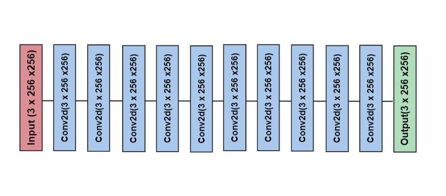

# Comparing Deep Learning Approaches for Image denoising

## Abstract: 
  In this project, we propose to implement and compare them using
  well-known datasets to apply and compare image-denoising models. We
  will use standard and new metrics to compare image-denoising results.
  We would use Basic CNN, Convolution skip Autoencoder, Residual Dense
  Network, Conditional GANs, and U-Net models architectures.
  
## Author:
- Dwijesh Jigarbhai Shah
- Haarika Ambati
- Kush Jayank Pandya

## Introduction

### Image Denoising

Image Denoising is a process to remove corruption in an image caused by
different factors. Denoising an image is difficult since the noise is
tied to the image’s high-frequency content, i.e., the details. As a
result, the goal is to strike a balance between suppressing noise as
much as possible and not losing too much information.

Owing to different factors of environment, transmission channel, and
other influences, images are inevitably contaminated by noise during
capturing, compression, and transmission, leading to loss of information
and other distortion. Due to this noise the further process of image
processing, such as image analysis and tracking would be affected.
Therefore, image denoising plays an important part image processing
systems.

### Types of Corruption

In this project, we are going to handle different types of frequent
image noise\[1\], which are:-

1.  **Salt Noise**: Its common noise seen in photography, they are
    bright and white pixel/small spots which is caused by digital images
    due to errors during the image capture or transmission process.

2.  **Pepper Noise**: Its common noise seen in photography, they are
    bright and black pixel/small spots which is caused by dead pixels or
    error in data transmission and failure in the memory cell.

3.  **Salt and Pepper Noise**: This type of digital image noise is
    characterized by randomly occurring white and black pixels
    resembling grains of salt and pepper.

<figure>
<figcaption aria-hidden="true">Displaying various types of noises</figcaption>
</figure>

### Types of Similarity Metrics

In our project, we compare our original image with the resultant
denoised image based on the following comparison metrics.

### Standard Image Similarity Metrics:-

Image denoising has long been a part of Deep Learning literature, \[2\]
showing what metrics are often used to compare different deep learning
architectures. The once we will use are as follows:-

1.  MAE/L1: The absolute difference between each predicted value and its
    associated actual value is added to determine the mean absolute
    error (MAE), then divided by the total number of data points. An
    indicator of the effectiveness of denoising in pictures is the
    average absolute difference, which compares the original image and
    the denoised image, wherein a lower MAE indicates better denoising
    performance.

2.  SSIM: A technique for forecasting the observed quality of digital
    television, cinematic images, and other types of digital images and
    videos is called the Structural Similarity Index Measure (SSIM). The
    distinction between these methods and others, like PSNR, is that
    they predict absolute errors. The concept of structural information
    that the pixels hold have strong interdependencies, particularly
    when they are spatially near one another. These dependencies carry
    important details about the structure of the items in the visual
    scene.

3.  PSNR: Peak signal-to-noise ratio (PSNR) is an engineering term for
    the ratio of a signal’s maximum possible power to the power of
    corrupting noise that compromises the representation of the signal’s
    fidelity. Most frequently, it is used to measure the quality of
    the reconstruction of lossy compression codecs. When comparing
    compression codecs in image compression, PSNR approximates the human
    perception of reconstruction quality.

#### Our Image Similarity Metrics:-

For comparing similarity metrics, there are many statistical tests (i.e
Chi-squared test, Two-sample t-test, Kruskal-Wallis test, Mann-Whitney U
test) but most of them require the distribution to be independent which
is not the case with our distribution. The two distribution we compare
are directly related by neural network and we cannot assume them to be
normal distribution.

Therefore we have made our own metric to comapre them. They are based on
these references \[3,4,5\].

1.  **Cosine Similarity** - This metric is a measure of similarity
    between two non-zero vectors in a high-dimensional space. The cosine
    similarity between two vectors $\\vec{H^O}$ and $\\vec{H^R}$ is
    defined as the cosine of the angle between them, represented by the
    dot product of the two vectors divided by the product of their
    magnitudes. The formula is given as:  
    

2.  **RMSE Similarity** - Root Mean square Error - This error is
    calculated by taking the square root of the average ofthe squared
    differences between the predicted and actual values. The formula is
    given as:  
    %20-%201%7D%7B(%5Cvec%7BH%5EO%7D%20-%20%5Cvec%7BH%5ER%7D)%5E2%7D%7D)

To use the above custom metric we need a single distribution but since
our images are RGB, we will get three distributions. Hence we will
concatenate these three distributions to form a histogram vector of size
(3\*256).

## Datasets

#### CelebA-HQ resized

This dataset\[10\] contains 30,000 high-quality celebrity faces,
resampled to 256 x 256 pixels.

#### LSUN

This is a large-scale scene understanding dataset\[11\], which includes
around 3 million images with 256 x 256 pixels resolution. We would use a
subset of this dataset for our project.

#### ImageNet

This is a large dataset\[12\] of over 14 million images with varying
resolutions. We will select about 30000 images for our project.

## Methodology

### Models Used

As discussed in the abstract, we would be using Basic CNN, Convolution
skip Autoencoder, Residual Dense Networks, Conditional GANs, and U-Net
models architectures.

#### Basic CNN

In this implementation, we are using 10 convolution layers with ’relu’
activation to do the image denoising. Each convolution layer applies a
set of filters (also known as kernels) to the input image. Each filter
scans the input image to identify specific features, such as edges,
corners, and textures. The architecture of our implementation is as
follows:

<figure>
<figcaption aria-hidden="true">Basic Convolution Neural Network of 10 layers</figcaption>
</figure>

#### Residual Network

ResNet is a type of neural network that uses skip connections\[6,7,9\].
It helps us to make deep networks by eliminating the vanishing gradient
problem. Its similar to to above network, except its deeper(20 layers)
and has periodic skip connections.

<figure>
<figcaption aria-hidden="true">Residual Network of 20 layers</figcaption>
</figure>

#### Symmetric Skip Autoencoders

It is a powerful tool for image denoising or reconstruction
applications. This type of neural network combines convolutional
autoencoders with skip connections\[5\].

This architecture makes use of the convolutional layers to encode and
decode images. The encoder component of the network extracts features
from the input image using convolutional layers and then compresses
those features into a lower-dimensional representation. The decoder part
of the network then uses deconvolutional layers to reconstruct the
original image from the compressed representation.

There are also skip connections between the corresponding layers of
encoding and decoding parts of the network, allowing information to skip
layers in a neural network. These connections help preserve essential
features and help prevent information loss, will enable the network to
preserve spatial information better and reduce the effect of vanishing
gradients during training. The architecture of this model is as follows:

<figure>
<figcaption aria-hidden="true">Symmetric Skip Autoencoder architecture</figcaption>
</figure>

#### U-Net

This architecture consists of an encoder and a decoder path, where the
encoder extracts high-level features from the input image and the
decoder generates a segmentation map. This is a deeper version of
convolutional autoencoder with skip connections. This architecture is
named after its U-shaped configuration, which resembles the shape of the
letter U. The encoder path is composed of multiple convolutional and
pooling layers, which gradually reduce the spatial dimensions of the
input. The decoder path is composed of convolutional and upsampling
layers that increase the spatial dimensions of the feature maps. The
main difference between symmetric skip connection and Unet is that,
rather than directly adding the skip connections in the symmetric
counter part while decoding, we concatenate the decoder and its
symmetric counter parts for further layer of processing.

<figure>
<figcaption aria-hidden="true">U-Net architecture</figcaption>
</figure>

#### Conditional GANs

Conditional Generative Adversarial Networks (GANs) are a type of GAN
where both the generator and the discriminator take some additional
input, such as class labels or some other form of conditioning
information, in addition to the noise input used in a traditional GAN.

In a conventional GAN, the discriminator uses both produced and real
images to distinguish between them, while the generator uses random
noise as input to create images. A conditional GAN generates images
belonging to a specific class using input that includes random noise and
some conditioning information, such as a class label.

For our use case, the input is a noised image, while the generator’s
output is a denoised image. The architecture for conditional GAN’s is as
follows:

<figure>
<figcaption aria-hidden="true">Generator of GANs</figcaption>
</figure>

We have used the same architecture as U-Net for the ’Generator’.

<figure>
<figcaption aria-hidden="true">Discriminator of GANs</figcaption>
</figure>

### Our Approach

We have used 256 x 256 input size for all the datasets. We will be
training our models with ’Imagenet’ dataset subset with 45000 images for
five epochs with salt and pepper noise.

Then we will get the metrics defined in section 1.3 and compare how our
dataset performed in conventional metrics and in our novel approach
metric. So we can see the difference between metrics.

## Results

In Figures 8,9,10, we can see our results. We have manipulated the axis
in such a way that the model performs better if it’s in the lower left
corner.

<figure>
<figcaption aria-hidden="true">Results for LSUN dataset</figcaption>
</figure>

<figure>
<figcaption aria-hidden="true">Results for celeba-Hq Dataset</figcaption>
</figure>

<figure>
<figcaption aria-hidden="true">Results for Imagenet mini Dataset</figcaption>
</figure>

# Observation and Conclusion

-   All the Autoencoder approach has seen better new metric results
    compared to conventional metric results. This may be because the
    skip connection between the encoder and decoder helps them preserve
    the structure, fine details, and histogram distribution.

-   Normally Trained U-Net has always performed better than other models
    in conventional as well as the new metric.

-   There is not much difference in the results of Basic CNN and Resnet.

-   Although the generator of Gans is a U-net architecture, we haven’t
    seen the same level of performance from it as we saw from a normal
    U-net. The reason for this may be that the GANS take more time and
    computation to optimize, and also, how weights and biases converge
    to minima depends on your training approach.

## References

1.  [ V. Lendave, “A Guide to Different Types of Noises and Image
    Denoising Methods,” Analytics India Magazine, Sep. 25, 2021.
    ](https://analyticsindiamag.com/a-guide-to-different-types-of-noises-and-image-denoising-methods/)

2.  [ H. Zhao, O. Gallo, I. Frosio and J. Kautz, "Loss Functions for
    Image Restoration With Neural Networks," in IEEE Transactions on
    Computational Imaging, vol. 3, no. 1, pp. 47-57, March 2017, doi:
    10.1109/TCI.2016.2644865.](https://ieeexplore.ieee.org/document/7797130)

3.  [M. Courthoud, “How to compare two or more distributions,” Medium,
    27-Dec-2022. \[Online\]. Available: . \[Accessed:
    10-Mar-2023\].](https://towardsdatascience.com/how-to-compare-two-or-more-distributions-9b06ee4d30bf)

4.  [L. Feng and P. Qiu, ‘Difference Detection Between Two Images for
    Image Monitoring’, Technometrics, vol. 60, 07
    2017.](https://www.tandfonline.com/doi/abs/10.1080/00401706.2017.1356378?journalCode=utch20)

5.  [ X.-J. Mao, C. Shen, and Y.-B. Yang, ‘Image Restoration Using
    Convolutional Auto-encoders with Symmetric Skip Connections’. arXiv,
    2016.](https://arxiv.org/abs/1606.08921)

6.  [J. Gurrola-Ramos, O. Dalmau and T. E. Alarcón, "A Residual Dense
    U-Net Neural Network for Image Denoising," in IEEE Access, vol. 9,
    pp. 31742-31754, 2021, doi:
    10.1109/ACCESS.2021.3061062.](https://www.semanticscholar.org/paper/A-Residual-Dense-U-Net-Neural-Network-for-Image-Gurrola-Ramos-Dalmau/bfc7ea161dc3bc5d43684bf95882121b04ff2c2e)

7.  [Y. Zhang, Y. Tian, Y. Kong, B. Zhong, and Y. Fu, ‘Residual Dense
    Network for Image Restoration’. arXiv,
    2018.](https://arxiv.org/abs/1812.10477)

8.  [La Javaness, “Image denoising with gan,” Medium, 04-May-2022.
    \[Online\].](https://lajavaness.medium.com/image-denoising-with-gan-17c3e6b97105. [Accessed: 10-Mar-2023].)

9.  [ Z. Wang, L. Wang, S. Duan, and Y. Li, ‘An Image Denoising Method
    Based on Deep Residual GAN’, Journal of Physics: Conference Series,
    vol. 1550, no. 3, p. 032127, May
    2020.](https://www.researchgate.net/publication/342208038_An_Image_Denoising_Method_Based_on_Deep_Residual_GAN)

10. [M. Odhiambo, “Celeba-HQ resized (256X256),” Kaggle, 30-Apr-2021.
    \[Online\].](https://www.kaggle.com/datasets
    /badasstechie/celebahq-resized-256x256. [Accessed: 21-Apr-2023].)

11. [“Papers with code - LSUN dataset,” LSUN Dataset \| Papers With
    Code.
    \[Online\].](https://paperswithcode.com/dataset/lsun. [Accessed: 10-Mar-2023].)

12. [ImageNet.
    \[Online\].](https://www.image-net.org/. [Accessed: 10-Mar-2023].)
